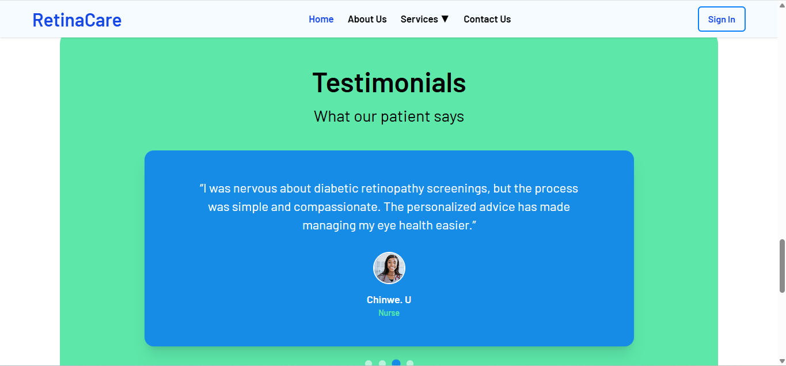
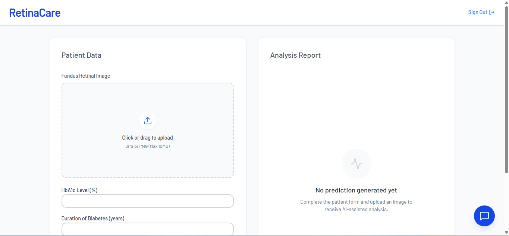
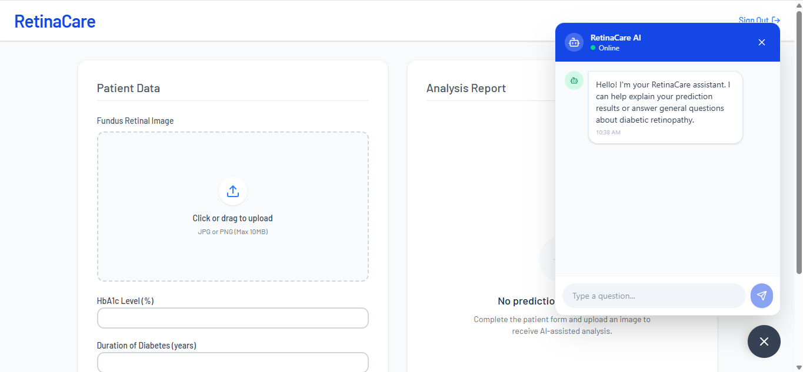
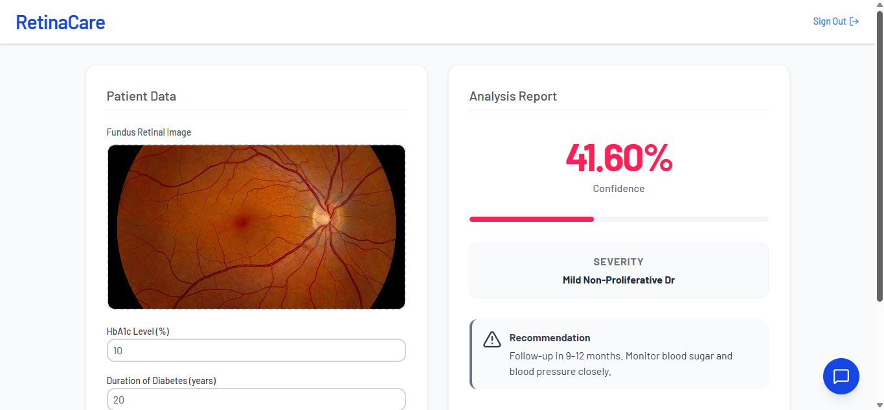

RetinaCare Frontend

## Overview

RetinaCare is an AI-powered diabetic retinopathy progression detector designed to help users analyze retinal fundus images, identify early signs of diabetic eye disease, and predict likely disease progression.
This repository contains the frontend of the RetinaCare application.

## Getting Started

Before running this application locally, ensure you have the following installed:

Node.js → https://nodejs.org/

## Installation & Setup

1. Clone the repository

```sh
   git clone https://github.com/RetinaCare/Frontend.git
```

2. Navigate to the project directory

```sh
   cd Frontend
```

(Replace Frontend with your actual project folder name if different.)

3. Install dependencies

```sh
   npm install
```

4. Start the development server

```sh
   npm run dev
```

Your app should now be available locally at:
http://localhost:5173/
(or whichever port Vite assigns)

## Project Structure

## Contributing

Please see the contribution guidelines: [CONTRIBUTING.md](docs/CONTRIBUTING.md)

## Live Demo

https://frontend-eosin-nu.vercel.app/

## Screenshots

<details>
<summary>Click to view screenshots</summary>










</details>

## 📘 Documentation

Full documentation is available in the `/docs` folder:

- [Project Overview](docs/project-overview.md)
- [Features](docs/features.md)
- [Tech Stack](docs/tech-stack.md)

## 📑 Presentation Slide (PDF)

## 🎨 Color Palette

Example:  
https://coolors.co/23408e-1447e6-5de7a9-ffffff-6a7282-1e2939
